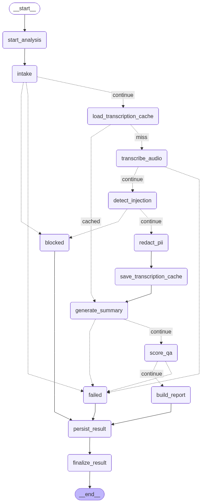

# Call Center Intelligence System

An AI pipeline that turns raw call-center audio into auditable QA scorecards, compliance flags, and redacted reports — built so that no unredacted text ever reaches an LLM, and no quality score ever comes from one.



## How It Works

You upload or record a call. The system:

1. **Validates intake** — checks the audio and sanitizes caller metadata, which is treated as untrusted input end to end
2. **Checks the transcription cache** — identical audio (by hash) reuses its transcript, but every run still gets its own analysis and audit trail
3. **Transcribes** — speaker-labeled, timestamped segments via OpenAI diarization, local faster-whisper, or a mock client, with long calls chunked locally first
4. **Screens for prompt injection** — an injection attempt in the transcript *or* the metadata ends the run as a `blocked` analysis with redacted security evidence. The text never reaches the model
5. **Redacts PII** — deterministic regex redaction over realistic call-center shapes: obfuscated emails, compact phone numbers, dates of birth, addresses, spoken account numbers, SSN fragments, verification codes
6. **Analyzes the redacted transcript** — structured-output summary with a phase-scored customer sentiment trajectory and action items, then a per-dimension QA assessment where every claim must cite a speaker-labeled, timestamped transcript quote
7. **Scores deterministically** — the overall QA score is computed in code from rubric weights over the per-dimension scores. The LLM never assigns it
8. **Persists and cleans up** — the report joins an immutable, append-only history with audit events, and the raw audio is deleted at the terminal graph step

Three terminal outcomes are first-class domain concepts, not error codes: **completed**, **supervisor review** (a report exists but needs human eyes — critical compliance flags, high-risk privacy events, or severe transcript-quality warnings), and **blocked** vs. **failed** — a safety stop and a system failure, deliberately distinct.

## Why It's Built This Way

Most LLM demos wire a model to a UI and stop. This project is the rest of the work — the part that makes an LLM feature shippable in a regulated domain.

- **Security runs before the LLM, not after.** Injection detection and PII redaction are pipeline stages that gate model access, not filters applied to output.
- **Evidence is mandatory.** Every quality dimension score requires at least one redacted transcript excerpt. Evidence with an unknown speaker can't support speaker-specific accountability claims.
- **Privacy is structural.** Raw transcripts are never persisted, raw audio is deleted on finalize, and only the redacted transcript is authoritative for display, reports, and history.
- **History is immutable.** Analyses, reports, and audit events are never deleted through user workflows. Re-analyzing a call creates a new analysis grouped by audio hash — and any two analyses of the same call can be diffed: configuration changes alongside dimension-level score, flag, and sentiment changes.
- **Everything expensive is swappable.** Transcription and analysis sit behind client interfaces with mock, local, and OpenAI implementations. The full pipeline runs, demos, and tests offline with zero API keys.

## Tech Stack

| Component | Technology | Why |
|-----------|-----------|-----|
| Orchestration | LangGraph | Explicit conditional routing for every failure mode — `blocked` and `failed` are graph nodes, not exceptions |
| Domain contracts | Pydantic v2 | Every artifact (summary, scorecard, flags, privacy events) is a validated model with invariants |
| Transcription | OpenAI diarization / faster-whisper / mock | Speaker-aware when real, free and offline when not |
| LLM analysis | OpenAI structured outputs / mock | Validated JSON in, domain models out — behind a client interface |
| Persistence | SQLAlchemy + SQLite | Immutable history, audit events, and a versioned transcription cache |
| Reports | ReportLab | Branded PDF scorecards with score bars, severity-coded flags, and evidence quotes |
| UI | Gradio | Four tabs: analyze, history, comparison, observability |
| Tracing | LangSmith (optional) | Pipeline observability when enabled |

## Project Structure

```
src/
├── models/      # Pydantic domain contracts and invariants
├── agents/      # intake validation and metadata sanitization
├── services/    # security (injection, PII), LLM analysis, transcription,
│                # history, comparison, analytics, downloads, audit
├── graph/       # LangGraph workflow, state, and routing
├── database/    # SQLAlchemy persistence facade + per-aggregate repositories
└── ui/          # Gradio app wiring and rendering
```

Design decisions are recorded where they were made: [CONTEXT.md](./CONTEXT.md) defines the domain language and every relationship, [docs/adr/](./docs/adr/) holds the architecture decision records ([analysis identity vs. transcription cache](docs/adr/0001-analysis-identity-and-transcription-cache.md), [redacted-transcript authority](docs/adr/0002-redacted-transcript-authority.md), [immutable history](docs/adr/0003-immutable-analysis-history.md), [no raw-audio retention](docs/adr/0004-no-raw-audio-retention.md)), and [docs/evaluation.md](./docs/evaluation.md) covers the demo evaluation harness.

## Testing

226 tests across three suites. None need API keys or model downloads.

| Suite | Covers |
|-------|--------|
| `tests/unit` | domain contracts, intake, LLM client behavior, sentiment, history filters, UI handlers and rendering |
| `tests/security` | PII redaction shapes, prompt injection detection and blocking |
| `tests/integration` | full graph runs, persistence, history/comparison/analytics services, report downloads |

```bash
make test               # unit + security
make test-integration
make test-all
make lint               # ruff
make eval-demo          # evaluates the latest persisted report for privacy
                        # safety, transcript completeness, and score structure
```

A separate smoke test (`make smoke-real AUDIO=/path/to/call.wav`) exercises real OpenAI transcription and analysis outside the normal suite.

## Quick Start

Requires Python 3.11–3.12 and [uv](https://docs.astral.sh/uv/).

```bash
make install
cp .env.example .env
make run                # http://localhost:7860
```

Defaults use mock transcription and analysis, so the full demo works offline. To run against real providers:

```bash
# .env
ANALYSIS_BACKEND=openai
OPENAI_API_KEY=sk-...
TRANSCRIPTION_BACKEND=openai_diarized   # or faster_whisper for local STT
```

Or with Docker:

```bash
docker build -t call-center-intelligence-system .
docker run --rm --env-file .env -p 7860:7860 call-center-intelligence-system
```

<details>
<summary>All environment settings</summary>

```bash
ANALYSIS_BACKEND=mock              # mock or openai
OPENAI_API_KEY=
OPENAI_MODEL=gpt-4o-mini
OPENAI_TRANSCRIPTION_MODEL=gpt-4o-transcribe-diarize
OPENAI_DIARIZED_CHUNK_SECONDS=180

TRANSCRIPTION_BACKEND=mock         # mock, faster_whisper, or openai_diarized
WHISPER_MODEL=base
WHISPER_DEVICE=auto
WHISPER_COMPUTE_TYPE=int8

DATABASE_URL=sqlite:///data/calls.db
LANGSMITH_TRACING=false
GRADIO_SERVER_NAME=0.0.0.0
GRADIO_SERVER_PORT=7860
```

The OpenAI diarized backend requires project access to `gpt-4o-transcribe-diarize`. Long calls are chunked locally before transcription, so a full-length call can take several minutes.

</details>

## Demo Walkthrough

1. On **Analyze Call**, upload or record audio, optionally add caller ID and department metadata, and pick mock or real backends. Set **Mock Compliance Mode = critical** to demo the `supervisor_review` path without live LLM behavior
2. Review the summary, weighted scorecard, speaker-labeled redacted transcript, compliance flags, and report JSON
3. On **Analysis History**, filter by status, text, or QA score range; select a row to generate JSON/PDF downloads
4. Analyze the same audio twice with different backends, then use **Compare Analyses** to see exactly what changed and why
5. **Observability** shows pipeline KPIs, daily trends, and the audit event stream

## License

[MIT](./LICENSE)
