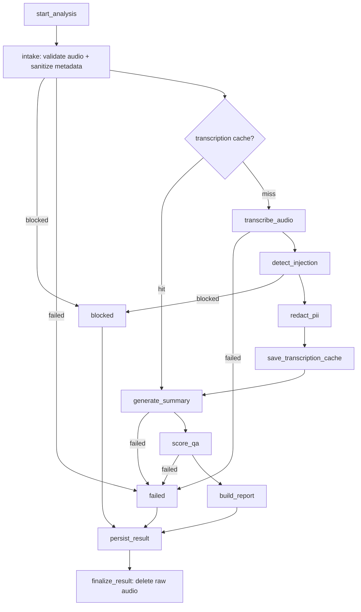

# Call Center Intelligence System

An AI pipeline that turns raw call-center audio into auditable QA scorecards, compliance flags, and redacted reports — built with LangGraph, Pydantic, and a security-first design where no unredacted text ever reaches an LLM.

Upload a call recording and the system validates the audio, screens for prompt injection, redacts PII, transcribes with speaker diarization, generates an evidence-backed summary and quality scorecard, and persists everything as immutable, auditable history with downloadable JSON and PDF reports.

## Why this project

Most LLM demos wire a model to a UI and stop there. This project is the rest of the work: the part that makes an LLM feature shippable in a regulated domain.

- **Security runs before the LLM, not after.** Prompt injection detection and deterministic PII redaction are pipeline stages that gate LLM access. An injection attempt produces a `blocked` analysis with redacted security evidence — not a generic error, and not a prompt that reached the model.
- **The LLM never assigns the score.** Models produce per-dimension assessments with required transcript evidence; the overall QA score is computed deterministically from rubric weights. Every quality claim must cite a redacted, speaker-labeled, timestamped excerpt.
- **Privacy is structural, not a filter.** Raw audio is deleted at the terminal graph step, raw transcripts are never persisted, and only the redacted transcript is authoritative for display, reports, and history.
- **History is immutable and auditable.** Analyses, reports, and audit events are never deleted through user workflows. Re-analyzing the same call creates a new analysis grouped by audio hash, and any two analyses of a call can be diffed — configuration changes alongside dimension-level score, flag, and sentiment changes.
- **Everything expensive is swappable.** Transcription and analysis sit behind client interfaces with mock, local (faster-whisper), and OpenAI (diarized) implementations. The full pipeline runs and tests offline with zero API keys.

## Pipeline

The core is a LangGraph state machine with explicit routing for every failure mode:



Three terminal outcomes are first-class domain concepts, not error codes: **completed**, **supervisor review** (a report exists but needs human attention — critical compliance flags, high-risk privacy events, or severe transcript-quality warnings), and **blocked**/**failed** (safety stop vs. system failure, deliberately distinct).

## Features

- **Gradio UI** with four tabs: analyze (upload or record), searchable analysis history grouped by call, side-by-side analysis comparison, and an observability dashboard with KPIs, daily trends, and audit events.
- **Speaker-aware transcription** via OpenAI diarization or local faster-whisper, with long calls chunked locally before provider calls and a versioned transcription cache keyed by audio hash.
- **Structured outputs end to end** — every artifact (summary, sentiment trajectory, scorecard, compliance flags, privacy events) is a validated Pydantic contract with domain invariants.
- **Customer sentiment trajectory** scored across opening, middle, and closing phases with a deterministic trend calculation.
- **Branded PDF reports** built with ReportLab: KPI strip, weighted scorecard with score bars, severity-coded compliance flags, evidence quotes, action items, and a confidentiality footer. JSON exports carry the full redacted report.
- **Deterministic PII redaction** covering realistic call-center shapes: obfuscated emails, compact phone numbers, dates of birth, addresses, spoken account numbers, SSN fragments, and verification codes.

## Architecture

```
src/
├── models/      # Pydantic domain contracts and invariants
├── agents/      # intake validation and metadata sanitization
├── services/    # security (injection, PII), LLM analysis, transcription,
│                # history, comparison, analytics, downloads, audit
├── graph/       # LangGraph workflow, state, and routing
├── database/    # SQLAlchemy persistence facade + per-aggregate repositories
└── ui/          # Gradio app wiring and rendering
```

Design decisions are recorded where they were made:

- [CONTEXT.md](./CONTEXT.md) — the ubiquitous-language document defining every domain term and relationship
- [docs/adr/](./docs/adr/) — architecture decision records, including [analysis identity vs. transcription cache](docs/adr/0001-analysis-identity-and-transcription-cache.md), [redacted-transcript authority](docs/adr/0002-redacted-transcript-authority.md), [immutable history](docs/adr/0003-immutable-analysis-history.md), and [no raw-audio retention](docs/adr/0004-no-raw-audio-retention.md)
- [docs/evaluation.md](./docs/evaluation.md) — the demo evaluation harness

## Testing

226 tests across three suites, none of which need API keys or model downloads:

| Suite | Covers |
|---|---|
| `tests/unit` | domain contracts, intake, LLM client behavior, sentiment, history filters, UI handlers and rendering |
| `tests/security` | PII redaction shapes, prompt injection detection and blocking |
| `tests/integration` | full graph runs, persistence, history/comparison/analytics services, report downloads |

```bash
make test               # unit + security
make test-integration
make test-all
make lint               # ruff
make eval-demo          # evaluates the latest persisted report for privacy
                        # safety, transcript completeness, and score structure
```

A separate real-provider smoke test (`make smoke-real AUDIO=/path/to/call.wav`) exercises OpenAI transcription and analysis outside the normal suite.

## Quick start

Requires Python 3.11–3.12 and [uv](https://docs.astral.sh/uv/).

```bash
make install
cp .env.example .env
make run                # http://localhost:7860
```

Defaults use mock transcription and analysis, so the full demo works offline. To run against real providers:

```bash
# .env
ANALYSIS_BACKEND=openai
OPENAI_API_KEY=sk-...
TRANSCRIPTION_BACKEND=openai_diarized   # or faster_whisper for local STT
```

Or with Docker:

```bash
docker build -t call-center-intelligence-system .
docker run --rm --env-file .env -p 7860:7860 call-center-intelligence-system
```

<details>
<summary>All environment settings</summary>

```bash
ANALYSIS_BACKEND=mock              # mock or openai
OPENAI_API_KEY=
OPENAI_MODEL=gpt-4o-mini
OPENAI_TRANSCRIPTION_MODEL=gpt-4o-transcribe-diarize
OPENAI_DIARIZED_CHUNK_SECONDS=180

TRANSCRIPTION_BACKEND=mock         # mock, faster_whisper, or openai_diarized
WHISPER_MODEL=base
WHISPER_DEVICE=auto
WHISPER_COMPUTE_TYPE=int8

DATABASE_URL=sqlite:///data/calls.db
LANGSMITH_TRACING=false
GRADIO_SERVER_NAME=0.0.0.0
GRADIO_SERVER_PORT=7860
```

The OpenAI diarized backend requires project access to `gpt-4o-transcribe-diarize`. Long calls are chunked locally before transcription, so a full-length call can take several minutes.

</details>

## Demo walkthrough

1. On **Analyze Call**, upload or record audio, optionally add caller ID and department metadata, and pick mock or real backends. Set **Mock Compliance Mode = critical** to demo the `supervisor_review` path without live LLM behavior.
2. Review the summary, weighted scorecard, speaker-labeled redacted transcript, compliance flags, and report JSON.
3. On **Analysis History**, filter by status, text, or QA score range; select a row to generate JSON/PDF downloads.
4. Analyze the same audio twice with different backends, then use **Compare Analyses** to see exactly what changed and why.
5. **Observability** shows pipeline KPIs, daily trends, and the audit event stream.

## Tech stack

**LangGraph** (orchestration) · **Pydantic v2** (domain contracts) · **SQLAlchemy + SQLite** (persistence) · **Gradio** (UI) · **OpenAI / faster-whisper** (transcription) · **ReportLab** (PDF) · **LangSmith** (optional tracing) · **uv / ruff / pytest** (tooling)
